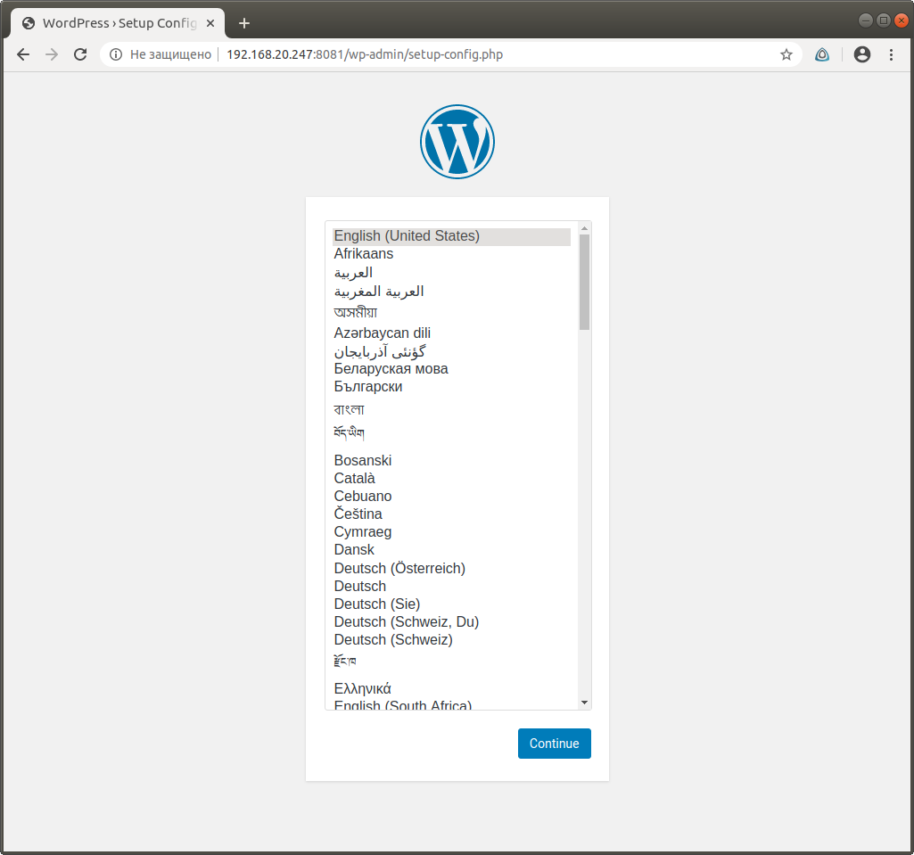
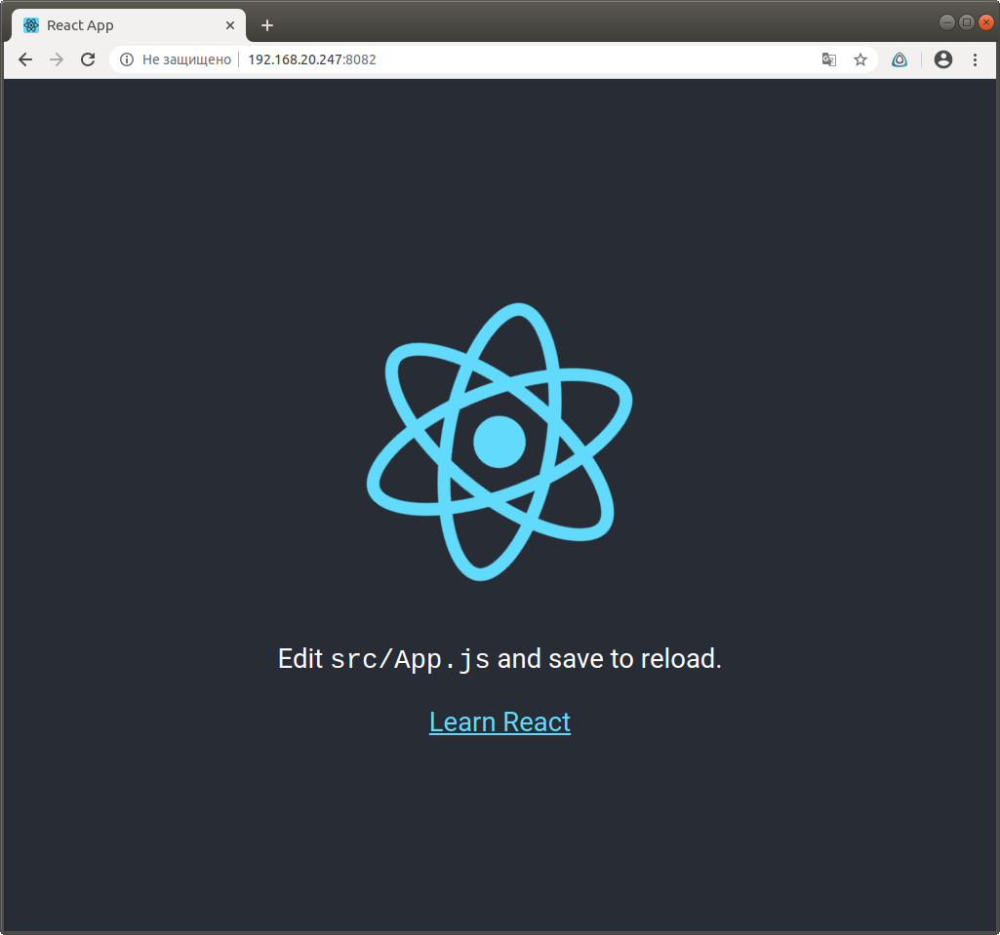
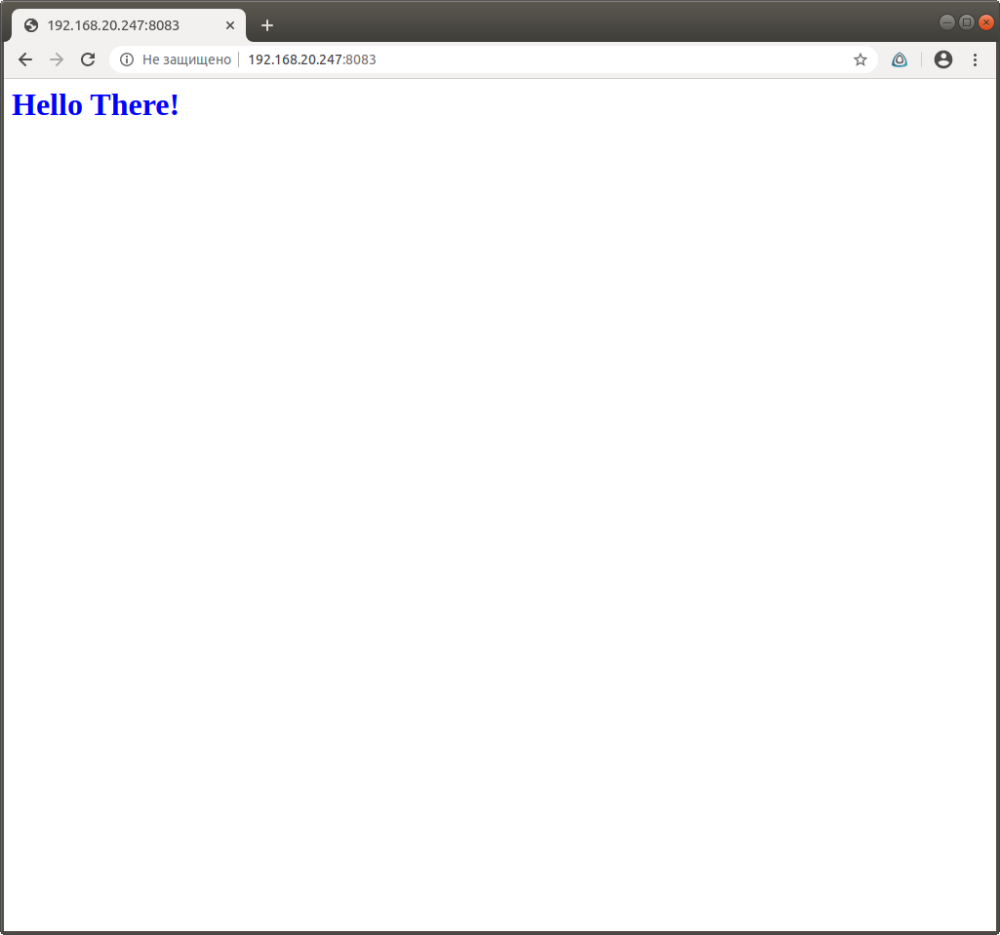

# Dynamic Web
Демо стенд с nginx для php-fpm, nodejs/react и flask
```bash
vagrant up
```
После запуска при обращении к соответствующим порта локалхоста отдает  
http://localhost:8081 - WordPress(php-fpm)  
http://localhost:8082 - демо приложение helloworld (NodeJS/react)  
http://localhost:8083 - демо приложение helloworld (python/flask)  
## Задание
Роль для настройки веб сервера  
Варианты стенда  
nginx + php-fpm (laravel/wordpress) + python (flask/django) + js(react/angular)  
nginx + java (tomcat/jetty/netty) + go + ruby  
можно свои комбинации  
  
Реализации на выбор  
- на хостовой системе через конфиги в /etc  
- деплой через docker-compose  
  
К сдаче примается  
vagrant стэнд с проброшенными на локалхост портами  
каждый порт на свой сайт  
через нжинкс  
## Выполнение
настройка стенда выполняется автоматически плэйбуком [web.yml](web.yml)  
перед запуском сервисов устаналиваются необходимые пакеты  
* nginx
* php-fpm из remi репозитория
* python-pip
* python-virtualenv для flask
* nodejs с сайта разработчика для react

Корень nginx /home/www/html/  
Все сервисы будут работать оттуда  
### WordPress
в конфиге php-fpm меняем юзера и порт меняем на сокет  
```yaml
    - name: php-fpm conf
      lineinfile:
        path: /etc/php-fpm.d/www.conf
        line: "{{ item.line }}"
        regexp: "{{ item.regexp }}"
        state: present
      with_items:
        - { regexp: "^user =", line: "user = nginx" }
        - { regexp: "^group =", line: "group = nginx" }
        - { regexp: "^listen =", line: "listen = /run/php-fpm/www.sock" }
        - { regexp: "^;listen.owner", line: "listen.owner = nginx" }
        - { regexp: "^;listen.group", line: "listen.group = nginx" }
```
Последний WP скачиваю с сайта разработчика  
```yaml
    - name: Download WP
      get_url:
        url: https://wordpress.org/latest.tar.gz
        dest: /opt/latest.tar.gz
```
### React/NodeJS
использую Node package manager для получения react демо приложения  
```yaml
    - name: create hello-world app
      shell: |
        cd /opt
        npm install -g create-react-app
        create-react-app hello-world
        cd /opt/hello-world
        npm run build

    - name: copy react app to html
      copy:
        src: /opt/hello-world/build/
        dest: /home/www/html/nodejs
        remote_src: yes
```
### Python/flask
Создаю виртуальное окружение для демо приложения flask  
```yaml
    - name: virtualenv
      pip: 
        virtualenv: /home/www/html/flask/helloworld/helloworldenv
        virtualenv_python: python2.7
        requirements: /home/www/html/flask/helloworld/requirements.txt
```
### Конфиги nginx
#### WP
```bash 
server {
    listen 8081;
    server_name wp.local;

    root /home/www/html/wordpress;
    index index.php;

    access_log /var/log/nginx/wp.local.access.log;
    error_log /var/log/nginx/wp.local.error.log;

    location / {
        try_files $uri $uri/ /index.php?$args;
    }

    location ~ \.php$ {
        try_files $uri =404;
        fastcgi_pass unix:/run/php-fpm/www.sock;
        fastcgi_index   index.php;
        fastcgi_param SCRIPT_FILENAME $document_root$fastcgi_script_name;
        include fastcgi_params;
    }

}
```
#### NodeJS/React
```bash
server {
    listen 8082;

    root /home/www/html/nodejs;
    index index.html;

    access_log /var/log/nginx/nj.access.log;
    error_log /var/log/nginx/nj.error.log;

    location / {
    try_files $uri /index.html =404;
  }
}
```
#### Flask
```bash
server {
    listen 8083;
    server_name flask.local;
    location / {
        include uwsgi_params;
        uwsgi_pass unix:/home/www/html/flask/helloworld/helloworld.sock;
    }

    access_log /var/log/nginx/flask.access.log;
    error_log /var/log/nginx/flask.error.log;
}
```
## Проверка
на моем хосте нет gui, поэтому обращаюсь к проброшенным наружу портам



